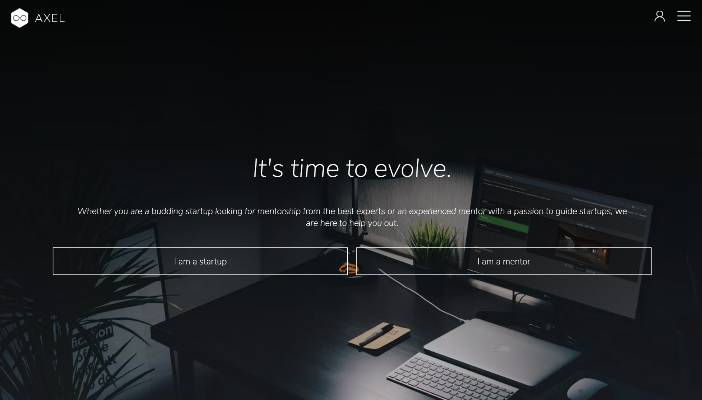
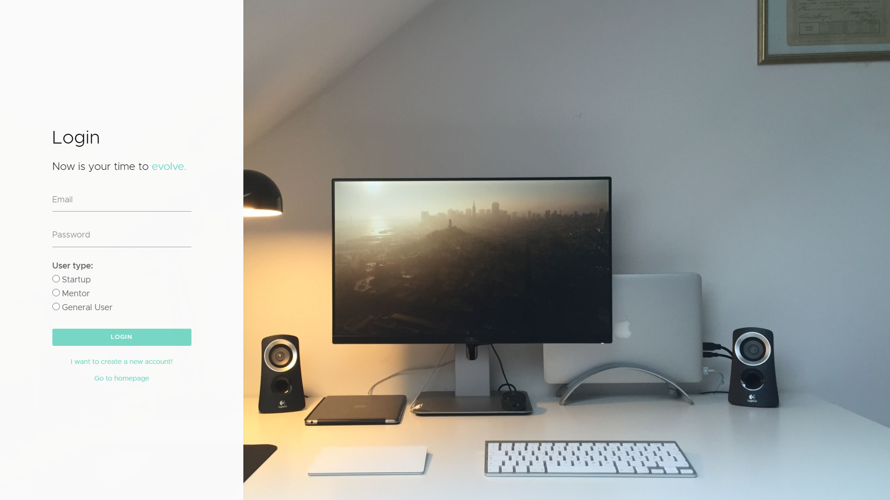
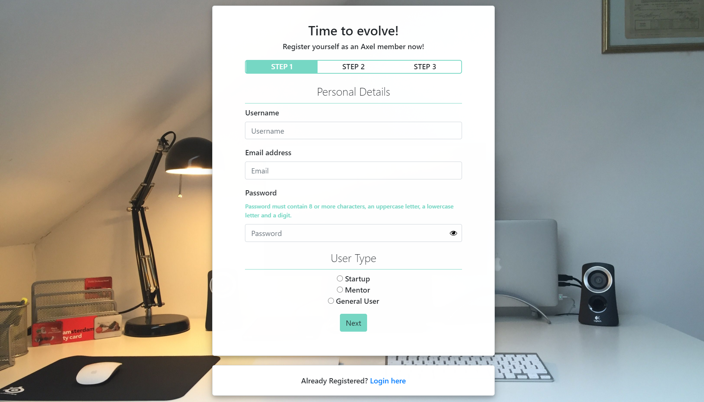
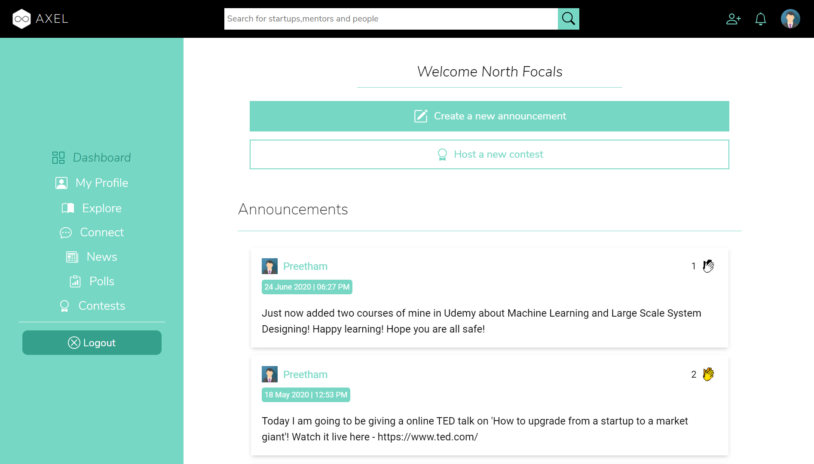
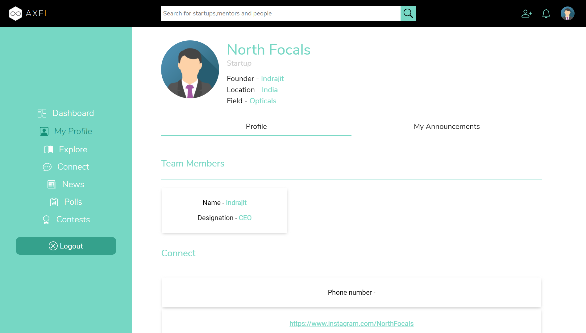
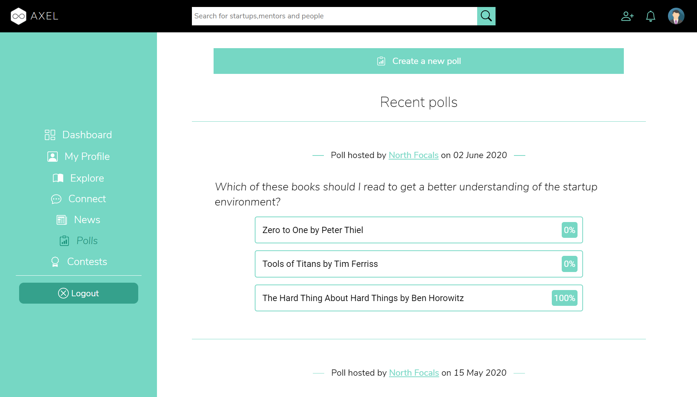
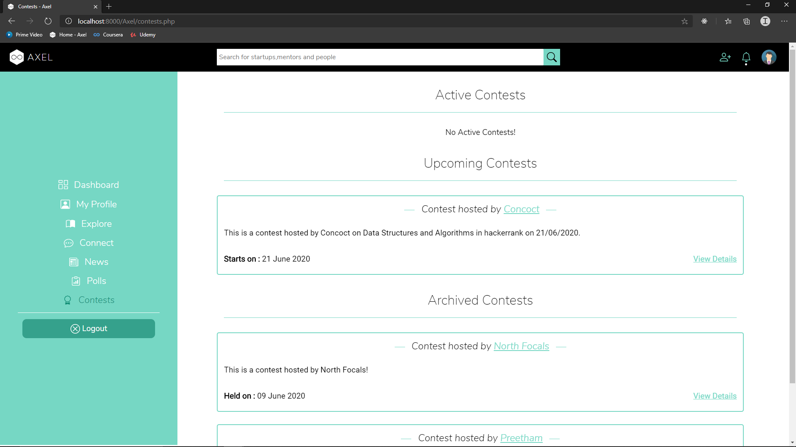
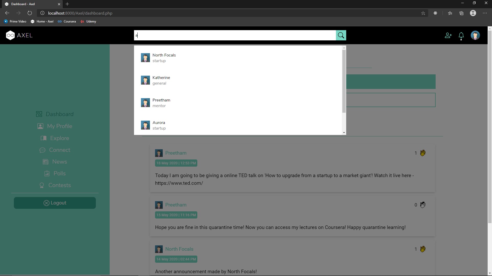

# AXEL

There are many success stories around start-ups now-a-days. Presently, there are very few online platforms for mentorship of start-ups. Mentoring and guidance are very critical for early stage start-ups. So, we are looking for a software solution for creating start-ups and mentor communities, helping start-ups to reach out to mentors in required domains and possible help to start-ups to reach at grass root level. **AXEL** is an web application is developed with ab interactive design, organized database and also with security. With three user groups such as *General users, Startup users and Mentoring users* this web application is moreover a social network pertaining to the growth of startups.

## Website Link - [Axel](https://thisisaxel.000webhostapp.com/)

---

## Screenshots

### Landing Page

### Login Page

### Register Page

### Dashboard

### Profile

### Connect 

### Polls

### Contests

### Search

---

### Note
This is a project done for **Software Package Development** by a team of 6 students.